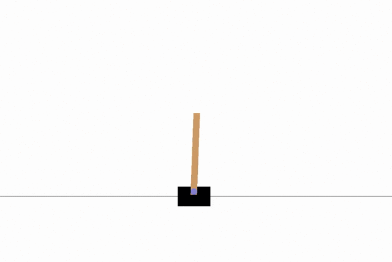
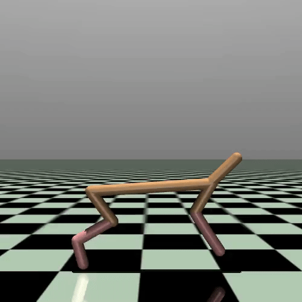
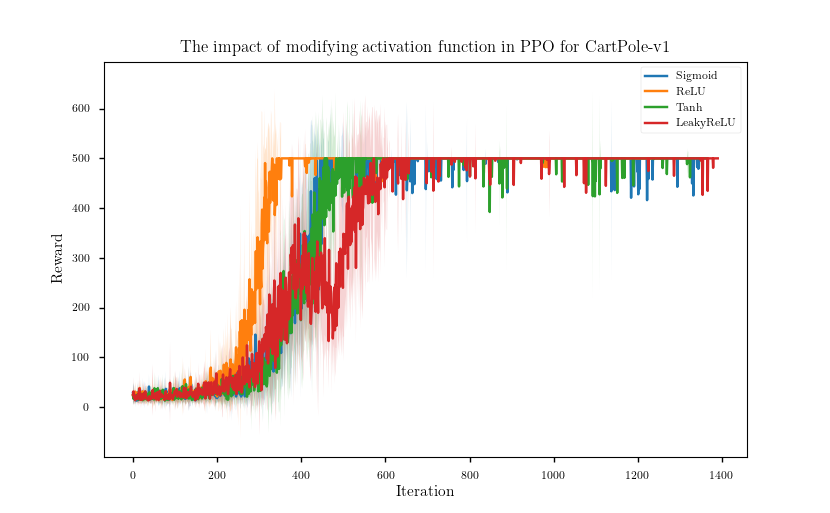
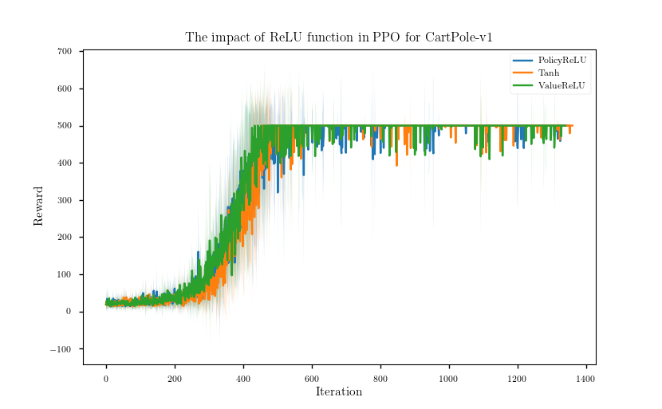
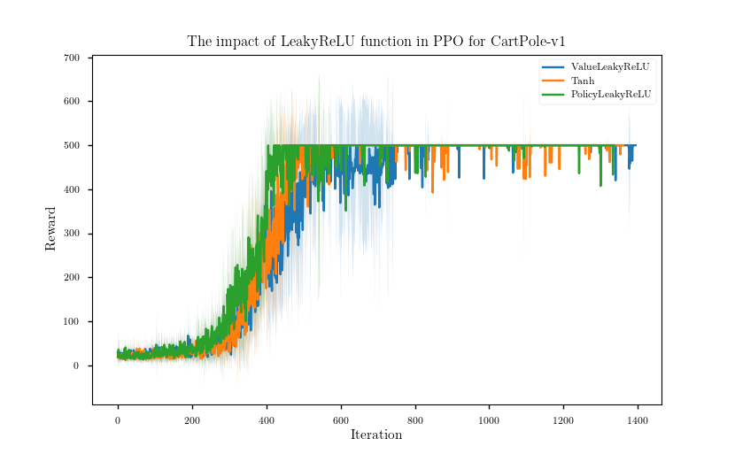
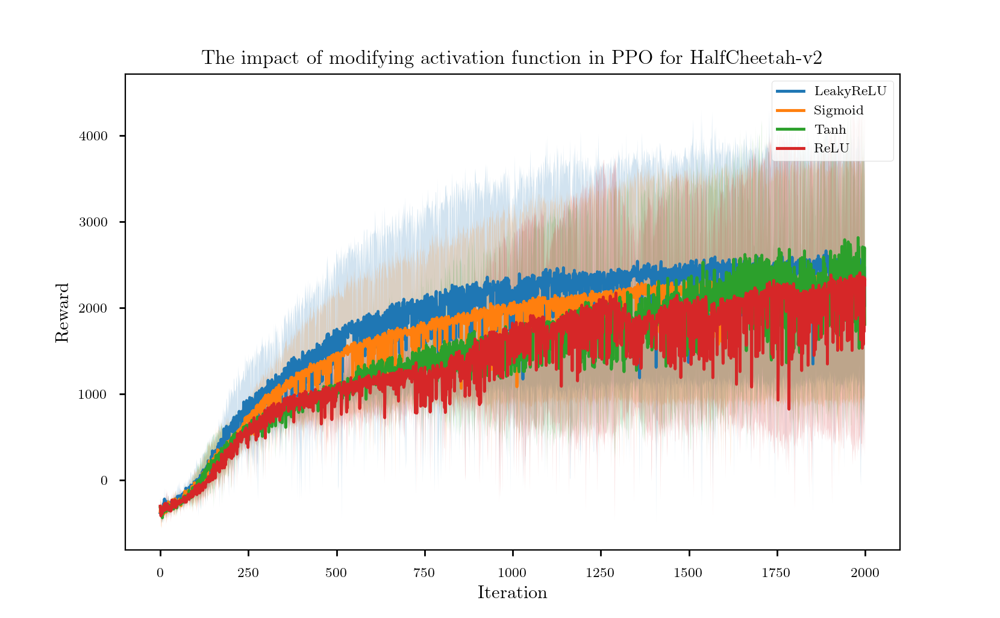
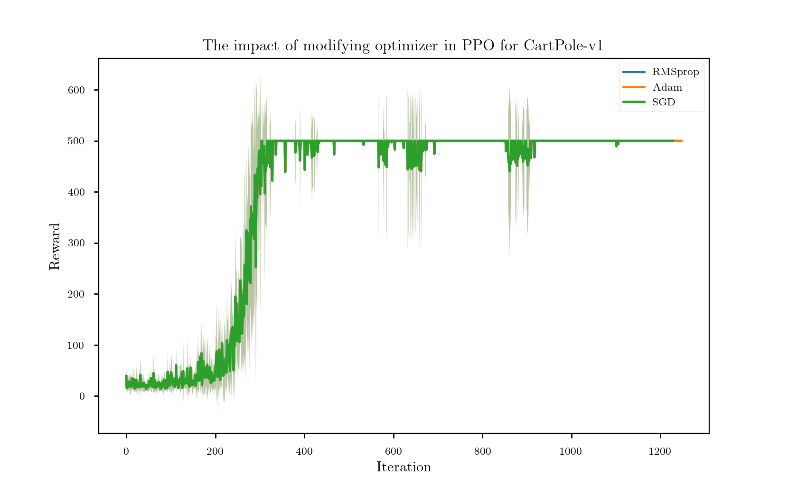

# Research internship - Requirement Analysis Evaluation of Deep Reinforcement Learning Methods

## Introduction

In order to solve complex control problem in high dimensional spaces, Deep Reinforcement Learning (DRL) has been developed in recent years. However, the **reproducibility** of DRL algorithms is tricky. There are several factors that can have impact on the overall perfoemance significantly, even for exactly the same underlying algorithms [1]. In addition, most of the papers in DRL area focus on explaining the new structure of the algorithms or the novel part rather than giving the whole detail of the code that was used to generate the results. Some implementation details could cause visible deviation for the same algorithm.

In this reasearch intership, more implementation details that could influence the overall performance were investigated. Activation function for the network and the optimizer were considered as influence factors. Proximal Policy Optimization (PPO) - as the most popular Deep Reinforcement Algorithm for real world application was used in this experiment. The overall performance (reward) was tested on two different GYM environment: "CartPole-V1" and "HalfCheetah-v2".

## Environment Information

For testing the Deep Reinforcement Learning algorithm, I used **Gym**, which is a toolkit for developing and comparing reinforcement learning algorithms. It contains various suite of environments that range from easy to difficult and involve many different kinds of data. I picked up "**CartPole-V1**" and "**HalfCheetah-V2**" to investigate the influence of the modification on low-dimensional and high-dimensional task, respectively.
### CartPole - V1

A pole is attached by an un-actuated joint to a cart, which moves along a frictionless track. The system is controlled by applying a force of +1 or -1 to the cart. The pendulum starts upright, and the **goal is to prevent it from falling over**. A reward of +1 is provided for every timestep that the pole remains upright. The episode ends when the pole is more than 15 degrees from vertical, or the cart moves more than 2.4 units from the center. [2]

The GIF below shows how it performs after training PPO 500000 timesteps:

### HalfCheetah - V2

The goal of this environment is to make the "Cheetah" run as fast as possible. Unlike CartPole task, here, the action space is continuous and the number of dimension is also higher. The GIF below shows the performence after training PPO 2000000 timesteps:

## Algorithm Information

## Experiments Results

### Activation Function

### Optimizer

## Conclusion

## Literature

[1] Peter Henderson, Riashat Islam, Philip Bachman, Joelle Pineau, Doina Precup, David Meger "*Deep Reinforcement Learning that Matters*", Thirthy-Second AAAI Conference On Artificial Intelligence (AAAI), 2018, arXiv:1709.06560

[2] Gym environment documentation: <https://gym.openai.com/envs/CartPole-v1/>
