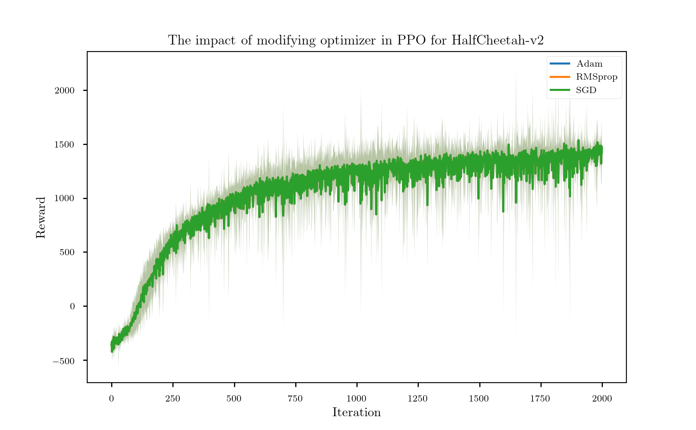

# Research internship - Requirement Analysis Evaluation of Deep Reinforcement Learning Methods

## Introduction

In order to solve complex control problem in high dimensional spaces, Deep Reinforcement Learning (DRL) has been developed in recent years. However, the **reproducibility** of DRL algorithms is tricky. There are several factors that can have impact on the overall perfoemance significantly, even for exactly the same underlying algorithms [1]. In addition, most of the papers in DRL area focus on explaining the new structure of the algorithms or the novel part rather than giving the whole detail of the code that was used to generate the results. Some implementation details could cause visible deviation for the same algorithm.

In this reasearch intership, more implementation details that could influence the overall performance were investigated. Activation function for the network and the optimizer were considered as influence factors. Proximal Policy Optimization (PPO) - as the most popular Deep Reinforcement Algorithm for real world application was used in this experiment. The overall performance (reward) was tested on two different GYM environment: "CartPole-V1" and "HalfCheetah-v2".

## Environment Information

For testing the Deep Reinforcement Learning algorithm, I used **Gym**, which is a toolkit for developing and comparing reinforcement learning algorithms. It contains various suite of environments that range from easy to difficult and involve many different kinds of data. I picked up "**CartPole-V1**" and "**HalfCheetah-V2**" to investigate the influence of the modification on low-dimensional and high-dimensional task, respectively.

### CartPole - V1

A pole is attached by an un-actuated joint to a cart, which moves along a frictionless track. The system is controlled by applying a force of +1 or -1 to the cart. The pendulum starts upright, and the **goal is to prevent it from falling over**. A reward of +1 is provided for every timestep that the pole remains upright. The episode ends when the pole is more than 15 degrees from vertical, or the cart moves more than 2.4 units from the center. [2]

The GIF below shows how it performs after training PPO 500000 timesteps:

### HalfCheetah - V2

The goal of this environment is to make the "Cheetah" run as fast as possible. Unlike CartPole task, here, the action space is continuous and the number of dimension is also higher. The GIF below shows the performence after training PPO 2000000 timesteps:

## Experiments Results

### Activation Function

In order to investigate the impacte of different activation function on overall performace of selected deep reinforcement learning algorithms, I modified the activation function in the policy function and value function respectively. I choose ”tanh”, ”ReLU” and ”Sigmoid” as variable, because they are commly used as basic activation function in most Neural Network. To visualization the performance, each vairant was carried out 20 times with 1400 iterations. Average performance (reward) and the confidence intervals are shown as performance indicator in this section.

> At first I wanted to see the general influence of the activation function. So I used the same activation function for policy net and value net. Above figure shows that although all algorithms end up with converging to the identical maximal reward (about 500), the speed of reaching the maximal reward (which indicates the performance of the exploration process) was sensitive to the activation function. ReLU can reach the maximal reward within 400 interations; Sigmoid and Tanh have similar performance, which needs more iterations than ReLU; For LeakyReLU, it is more interesting: before 400th iteration, it had similar behavior like Sigoid and Tanh. However, from that point, the performance of the policy even gets worse for about 100 iterations. Then it was improved from 500th iteration with similar gradient as Sigmoid and Tanh.

> For futher investigating which network is more sensitive in this case, I repeated the experiment. This time, I set Tanh as standard activtion function, then modified just one activation functin to ReLU & Leaky ReLU separately. (for policy net and value net respectively)

> The results show that there is almost no difference after changing one of the activation fucntion to ReLU function. For LeakyReLU, changing the activation function in policy net to LeakyReLU seems to improve the performance. Conversely, changing the activation function in value net to LeakyReLU would make the policy worse. But the differences are minor compared with changing the both activation functions to LeakyReLU.

> For high-dimensional case, ReLU has the worst performance, which is similar to Tanh. Sigmoid has better performance than them. LeakyReLU has the best performance. The results are totally different. It could indicate that Deep Reinforcement Learning algorithm is indeed very sensitive to the modification of activation function. 

### Optimizer

With the same parameter setting, I also investigated the impact of modifying optimizer on overall performance. The following figures clearly show that the modification of optimizer did not influence the overall performance in our case.

## Conclusion

PPO is robust to the modification of optimizer in both low-dimensional and high-dimensional cases. However, it is very sensitive to the change of activation function. 

In low-dimensional case, using ReLU as activation function for both networks seems to be able to improve the performance. LeakyReLU could make the exploration process worse, if it is used in both networks, but it could improve the performance if it is only used in policy net. Bad selection of activation function can lead to the loss of information of the input or the exponential vanishing/exploding of gradients. In our case, maybe it goes to the place where the gradient is tiny for tanh and sigmoid, so that the learning of the network is not efficient. That could lead to a longer exploration phase. And according to [3], if the dimensionality of the data is low, then the minimum eigenvalue of the Gram matrix can be small leading to slow training.

In high-dimensional case, LeakyReLU has the best performance, ReLU is the worst. It is totally different to low-dimentional case. Probably, in high-dimensional task, the downside for ReLU donimants. According to the shape of ReLU, for all negative values, the value is zero, which leads to "dying ReLU" problem. And LeakyReLU not only solve this problem, but also has the advantages like in low-dimensional case (no gradient vanishing), therefore it has the best performance.

## Literature

[1] Peter Henderson, Riashat Islam, Philip Bachman, Joelle Pineau, Doina Precup, David Meger "*Deep Reinforcement Learning that Matters*", Thirthy-Second AAAI Conference On Artificial Intelligence (AAAI), 2018, arXiv:1709.06560

[2] Gym environment documentation: <https://gym.openai.com/envs/CartPole-v1/>

[3] A. Panigrahi, A. Shetty, N. Goyal “*Effect of Activation Functions on the Training of Overparametrized Neural Nets*”, arXiv:1908.05660